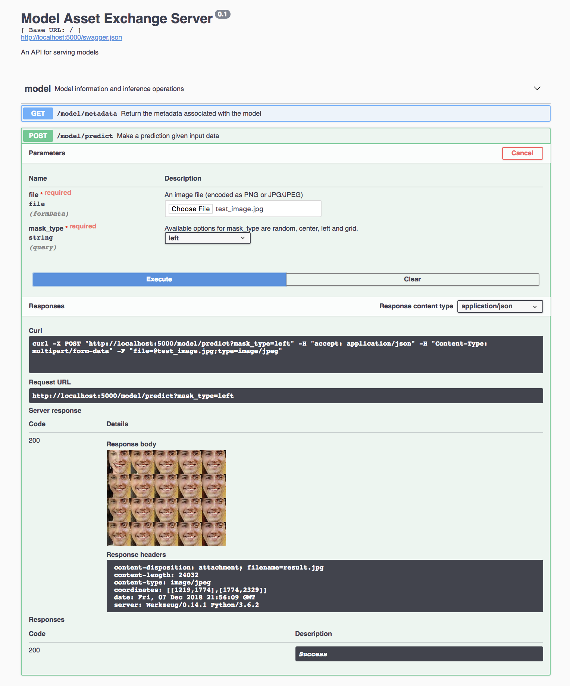

[](https://travis-ci.com/IBM/MAX-Image-Completer)

# IBM Developer Model Asset Exchange: Image Completer

This repository contains code to instantiate and deploy an image completer model. The goal is to fill in missing or 
corrupted parts of an image. This model uses Deep Convolutional Generative Adversarial Networks (DCGAN) to fill the missing regions in an image. The model is trained on the [celebA dataset](http://mmlab.ie.cuhk.edu.hk/projects/CelebA.html) and works best for completing corrupted portions of a human face. Input to the model is an image containing a single corrupted face. The [OpenFace](https://github.com/cmusatyalab/openface) face recognition tool will detect and extract the corrupted face from the input image. This extracted face is then passed to the OpenFace alignment tool where it is aligned (inner eyes with bottom lip) and resized (64 x 64) producing an output that can be used by the model to fill the corrupted portions. The output is a collage of 20 images, in a 4x5 grid, representing the intermediate results and final completed image (bottom-right).

The model is based on the [Tensorflow implementation of DCGAN](https://github.com/bamos/dcgan-completion.tensorflow). The model weights are hosted on [IBM Cloud Object Storage](https://max-assets.s3-api.us-geo.objectstorage.softlayer.net/image-completer/1.0/checkpoint.tar.gz). The code in this repository deploys the model as a web service in a Docker container. This repository was developed as part of the [IBM Developer Model Asset Exchange](https://developer.ibm.com/exchanges/models/).

_NOTE: Model takes about a minute to return the result._

## Model Metadata
| Domain | Application | Industry  | Framework | Training Data | Input Data Format |
| ------------- | --------  | -------- | --------- | --------- | -------------- | 
| Vision | Image Completion | General | Tensorflow | [celebA dataset](http://mmlab.ie.cuhk.edu.hk/projects/CelebA.html) | Images |

## References

* _Raymond A. Yeh, Chen Chen, Teck Yian Lim, Alexander G. Schwing, Mark Hasegawa-Johnson, Minh N. Do_, ["Semantic Image Inpainting with Deep Generative Models"](https://arxiv.org/abs/1607.07539), CVPR 2017.
* [DCGAN Tensorflow for image completion Github Repo](https://github.com/bamos/dcgan-completion.tensorflow)
* [OpenFace for facial recognition](https://github.com/cmusatyalab/openface)

## Licenses

| Component | License | Link  |
| ------------- | --------  | -------- |
| This repository | [Apache 2.0](https://www.apache.org/licenses/LICENSE-2.0) | [LICENSE](LICENSE) |
| Model Weights | [MIT](https://opensource.org/licenses/MIT) | [DCGAN completion Repository](https://github.com/bamos/dcgan-completion.tensorflow/blob/master/LICENSE) |
| Model Code (3rd party) | [MIT](https://opensource.org/licenses/MIT) | [DCGAN completion Repository](https://github.com/bamos/dcgan-completion.tensorflow/blob/master/LICENSE) |
| OpenFace | [Apache 2.0](https://www.apache.org/licenses/LICENSE-2.0) | [OpenFace Repository](https://github.com/cmusatyalab/openface/blob/master/LICENSE) |
| Test assets | Various | [Assets Readme](assets/README.md) |

## Pre-requisites:

* `docker`: The [Docker](https://www.docker.com/) command-line interface. Follow the [installation instructions](https://docs.docker.com/install/) for your system.
* The minimum recommended resources for this model is 2GB Memory and 2 CPUs.

# Steps

1. [Deploy from Docker Hub](#deploy-from-docker-hub)
2. [Deploy on Kubernetes](#deploy-on-kubernetes)
3. [Run Locally](#run-locally)

## Deploy from Docker Hub

To run the docker image, which automatically starts the model serving API, run:

```
$ docker run -it -p 5000:5000 codait/max-image-completer
```

This will pull a pre-built image from Docker Hub (or use an existing image if already cached locally) and run it.
If you'd rather checkout and build the model locally you can follow the [run locally](#run-locally) steps below.

## Deploy on Kubernetes

You can also deploy the model on Kubernetes using the latest docker image on Docker Hub.

On your Kubernetes cluster, run the following commands:

```
$ kubectl apply -f https://github.com/IBM/MAX-Image-Completer/raw/master/max-image-completer.yaml
```

The model will be available internally at port `5000`, but can also be accessed externally through the `NodePort`.

## Run Locally

1. [Build the Model](#1-build-the-model)
2. [Deploy the Model](#2-deploy-the-model)
3. [Use the Model](#3-use-the-model)
4. [Development](#4-development)
5. [Cleanup](#5-cleanup)


### 1. Build the Model

Clone this repository locally. In a terminal, run the following command:

```
$ git clone https://github.com/IBM/MAX-Image-Completer.git
```

Change directory into the repository base folder:

```
$ cd MAX-Image-Completer
```

To build the docker image locally, run: 

```
$ docker build -t max-image-completer .
```

All required model assets will be downloaded during the build process. _Note_ that currently this docker image is CPU only (we will add support for GPU images later).


### 2. Deploy the Model

To run the docker image, which automatically starts the model serving API, run:

```
$ docker run -it -p 5000:5000 max-image-completer
```

### 3. Use the Model

The API server automatically generates an interactive Swagger documentation page. Go to `http://localhost:5000` to load it. From there you can explore the API and also create test requests.

Use `model/predict` endpoint to load a test image and get completed image back from the API. Click on `'Try it out'` to start testing the model.

Acceptable image types are png, jpg and jpeg. Four different mask options are provided and the selected mask will be applied on the image before proceeding to completion process. The available options are `random`, `center` (default), `left` and `grid`. 

Output will be a collage of all intermediate results explaining the completion process and the last image (bottom-right) is the final completed image. 



Response header `coordinates` indicates the coordinates (top-left + bottom-right) of the extracted face from the input image.

You can also test it on the command line, for example:

```
$ curl -F "file=@assets/input/test_image.jpg" -XPOST http://localhost:5000/model/predict?mask_type=left -o result.jpg
```

Available options for `mask_type` are `random`, `center`, `left` and `grid`.

### 4. Development

To run the Flask API app in debug mode, edit `config.py` to set `DEBUG = True` under the application settings. You will then need to rebuild the docker image (see [step 1](#1-build-the-model)).

### 5. Cleanup

To stop the Docker container, type `CTRL` + `C` in your terminal.
